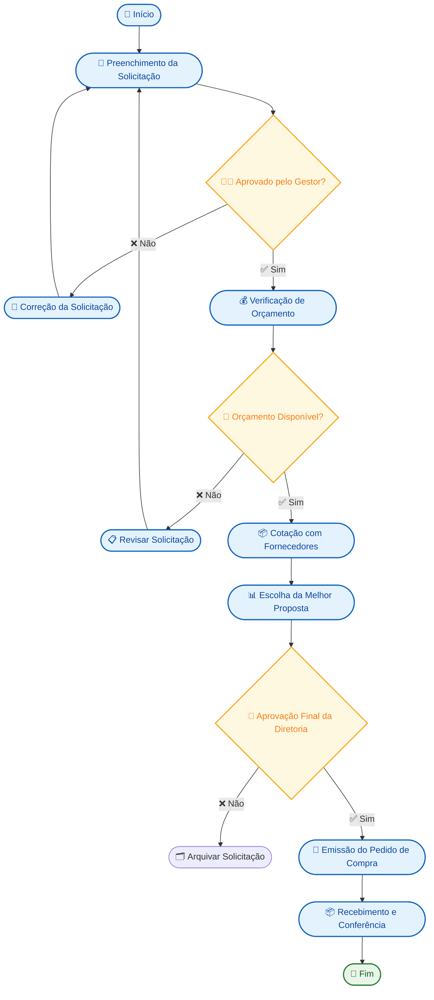

# 🧠 Workshop Lean Office na Prática

> Capacitação para aplicar o **Lean Office** em processos administrativos, utilizando ferramentas digitais e metodologias de melhoria contínua.

---

## 🎯 Objetivo Geral

Capacitar profissionais para **mapear, padronizar e melhorar processos administrativos**, reduzindo desperdícios e aplicando **melhoria contínua (Kaizen)** com o auxílio de ferramentas digitais.

---

## 🏭 O que é Lean Office?

O **Lean Office** adapta os princípios do **Lean Manufacturing** (Sistema Toyota de Produção) para o ambiente administrativo.  
Seu foco é **aumentar o valor entregue ao cliente** e **eliminar tudo o que não agrega valor**.

Pilares fundamentais:
- 🌀 **Kaizen (Melhoria Contínua)**
- 🤝 **Respeito pelas Pessoas**

---

## ⚙️ Os 8 Desperdícios do Lean (DOWNTIME)

| Desperdício | Descrição | Exemplo em Escritório |
|--------------|------------|-----------------------|
| **D - Defeitos** | Erros e retrabalhos | Corrigir formulários errados |
| **O - Overproduction** | Excesso de produção | Relatórios duplicados |
| **W - Waiting** | Esperas desnecessárias | Aprovação parada no gestor |
| **N - Non-utilized Talent** | Talento não aproveitado | Falta de autonomia nas tarefas |
| **T - Transportation** | Movimentação | Envio manual de arquivos |
| **I - Inventory** | Estoques de informação | Solicitações acumuladas |
| **M - Motion** | Movimentação excessiva | Buscar arquivos em pastas diferentes |
| **E - Extra-processing** | Trabalho redundante | Repreencher informações já existentes |

---

## 🧰 Ferramentas Digitais Lean

| Categoria | Exemplos |
|------------|-----------|
| **Mapeamento de Fluxos** | Miro, Lucidchart, Draw.io |
| **Gestão Visual** | Trello, Notion, Monday |
| **Automação de Rotinas** | Power Automate, Zapier |
| **Gestão Documental** | Google Workspace, MS 365 |
| **Análise de Tempo** | Toggl, Clockify |
| **Melhoria Contínua** | Forms, LeanKit, Kaizen App |

---

## ⚙ Etapas para Implementar o Lean Office

1. **Diagnóstico** — Identificar desperdícios e gargalos.  
2. **Padronização (5S)** — Organizar e documentar processos.  
3. **Automação** — Eliminar esperas e tarefas manuais.  
4. **Medição** — Acompanhar indicadores de desempenho.  
5. **Kaizen** — Promover melhorias frequentes e sustentáveis.

---

## 🧩 Atividade Prática 1 — Mapeamento do Processo Atual

Escolha um processo comum (ex: **Solicitação de Compras**) e crie um **fluxograma no Miro** ou diretamente no GitHub com o diagrama abaixo.

---

## 🗺️ Modelo Visual de Fluxograma (Mermaid)

> 💡 Este modelo pode ser renderizado diretamente no GitHub, GitLab ou VS Code Preview com suporte a Mermaid.

---

## 🌱 Cultura de Melhoria Contínua
| Conceito	| Descrição |
|-----------|-----------|
|5S|	Organização, limpeza e padronização.|
|Kaizen|	Pequenas melhorias diárias e sustentáveis.|
|Hansei|	Autoavaliação e aprendizado após cada ciclo.|
|Gestão à Vista|	Transparência de informações e indicadores.|

---

## 📊 Indicadores de Desempenho (KPIs)
|Indicador|	Descrição|	Meta|
|---------|----------|------|
|⏱️ Tempo Médio de Aprovação|	Duração total entre solicitação e aprovação|	↓ 20%|
|🔁 Taxa de Retrabalho	|% de solicitações devolvidas	|< 5%|
|😊 Satisfação do Usuário|	Avaliação dos colaboradores	|≥ 90%|
|♻️ Kaizens Realizados|	Número de melhorias implementadas	|≥ 2/mês|

---

## 📘 Referências

* The Toyota Way — Jeffrey Liker

* Lean Thinking — Womack & Jones

* Kaizen — Masaaki Imai

---

## 👷 Autor e Facilitador

### Desenvolvido por Frederico Aguiar

---

## 📍 Capacitação em Lean Office e Melhoria Contínua Digital

## 🎯 Licença

Este material é de uso educacional e interno.
Reprodução, redistribuição ou modificação sem autorização prévia é proibida.
